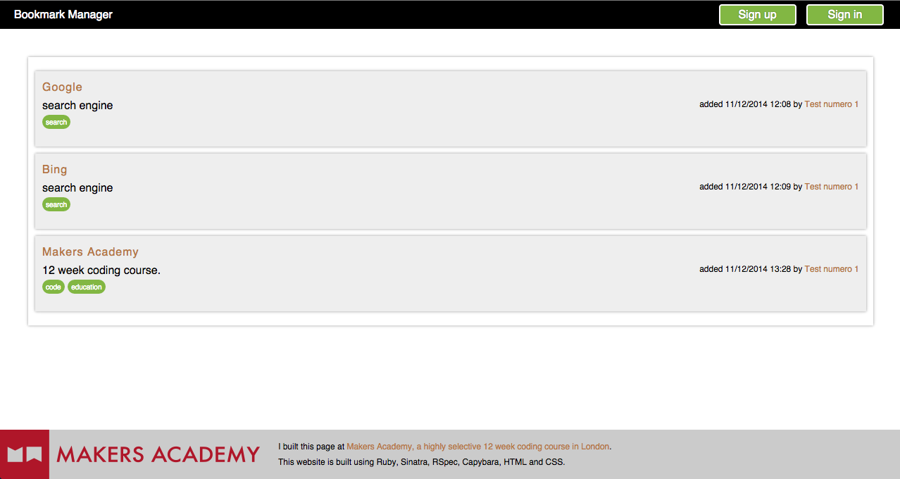

Week 4 at Makers Academy
========================

Objective
==========

Buil a Bookmark Manager with database. 
The website should:
- Show a list of links from the database
- Add new links
- Add tags to the links
- Filter links by tag

Techonologies used
==================
    - Ruby
    - RSpec
    - Sinatra
    - Capybara
    - PostgreSQL
    - HTML
    - CSS
    
How to use it
==============
Access the site in Heroku: 
https://ana-bookmark.herokuapp.com/
